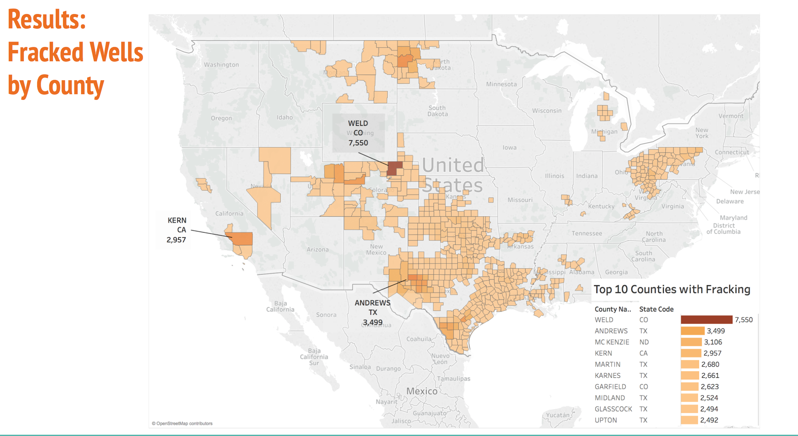
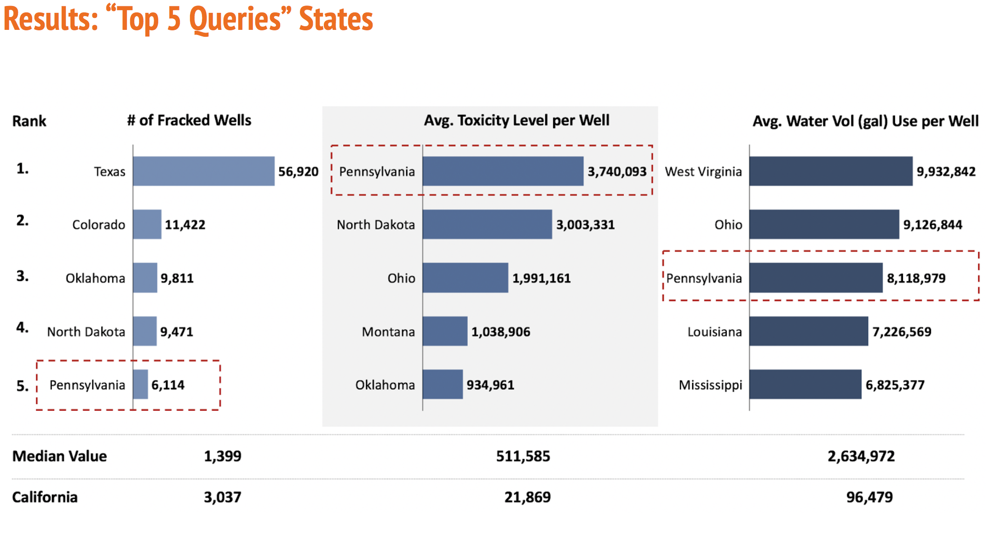

# w205-Project
# W205-Fracking Project Execution Instructions

** **

## Overview

This project combines publically available data on hydraulic fracturing, water usage, earthquakes, and chemical toxicity to determine insights into the risks of hydraulic fracturing. It can estimate the volume of toxic chemicals used in a frac and find nearby water sources, such as streams or wells. It can provide county by county references on total water usage for fracking. It also overlays earthquakes and fracks to search for a correlation between fracking activity and seismic activity, though any connection would primarily occur in Kansas and Oklahoma

## File Structure

The files required to complete the project are listed on [https://github.com/jayur/w205-Project](https://github.com/jayur/w205-Project) with an exception of &quot;chemical\_usage.csv&quot;, containing the chemical usages of each well, is loaded on the &quot;working AMI&quot; (described below). This is because the &quot;chemical\_usage.csv&quot; is above the limit of Github upload.

| **File Name** | **File Description** |
| --- | --- |
| **APISTATECOUNTYCODES.csv** | American Petroleum InstituteState/County Codes |
| **USGSCountyStateCode.csv** | US Geological State Codes |
| **USGSSitetypes.csv** | US Geological Site Types |
| **Frack Analytics.pdf** | Detailed Schema |
| **Xtractload\_frackdb.py** | Python script which create the database and loads the data from the csv files to the staging tables |
| **transform\_frackdb.py** | Python Script to transform frackdb from staging to database |
| **clean\_quake\_data.py** | Python script to clean earthquake data |
| **getQuakeData.sh** | Shell script to pull earthquake data from USGS |
| **dlwaterdata.py** | Python script to pull water data from USGS water |
| **state.csv** | List of state names and codes |
| **toxcast.csv** | Chemical information: toxicity and CAS number |
| **well\_site.csv** | frackfocus data on fracked wells |
| **chemical\_usage.csv** | Frackfocus data on the chemical usage by the fracked wells - It could not be uploaded to Github because of its size(&gt; 500MB) but it is there in the AMI |
| **Risk Assessment of Fracking- Final Presentation.pdf** | Final Presentation |
| **serving\_queries.pdf** | Sample queries and their results |
| **frack\_book.twb** | Example tableau book for visualization |
| **build\_frack.sh** | Compiled shell script to run all dependent scripts to create frackdb database |

## Python Dependencies

- psycopg2
- pandas
- numpy
- wget
- reverse\_geocoder
- os

## Loading and Extracting the data

Fracfocus data can only be downloaded manually because of the required authentication steps, so the data is already loaded into the AMI. The frackfocus data contains information on wells from 2013. To extract the data from frackfocus compressed file, we have to install SQL Server Management Studio and SQL DB express(local instance of SQL Server DB). Once this has been installed, we then have to restore the fracfocus database from the backup file. We run queries to extract the Well Site and Chemical Usage data on the local database. Since we cannot automate this, we have extracted the csv files and uploaded them to the AMI. The extracted data are in well\_site.csv and chemical\_usage.csv (which is in the AMI, but not the github repository). Well\_site.csv contains data on all wells fracked going after 2013. Chemical\_usage.csv has data on the chemicals used by every well. 

The other tables, describing water bodies, earthquakes, and chemical toxicity are also in the ami, but can be downloaded using the build\_frack.sh script. The script first runs dlwaterdata.py, which downloads data from the USGS National Water information system. The NWIS only allows download of data from one state at a time, so a python script was considered better than a shell script for downloading the data and converting it to a cleaned-up csv. The script downloads each tab separated file, attaches it to a Pandas Dataframe, and then deletes the original file, before outputting the cleaned-up csv.

The shell script getQuakeData.sh installs functions and wrapper scripts for accessing national earthquake data, and then downloads it.

Clean\_quake\_data.py takes the latitudes and longitudes from from the getQuakeData script, and uses reverse geocoder to determine counties.

Xtractload\_frackdb.py will create the frackdb database in postgres and then create and fill out the tables. Transform\_frackdb.py takes those tables and transforms them to fit our schema.

## Working AMI Information

On AWS, we loaded all the data into a Postgres database and required python packages into a public AMI called **W205-Project-Final** (id: ami-7a8bea6c). The AMI should be run with at least m3.large instance and port 5432 open. It has an EBS volume, containing the data. The following command line can be used to access the frackdb database in Postgres:

```
mount -t ext4 /dev/xvdf /data

/root/start-hadoop.sh

/data/start\_postgres.sh

su - w205

psql -U Postgres

\c frackdb
```

Within frackdb database, the user can perform analytical queries on the data. Examples and results are given in &quot;serving\_queries.pdf&quot;


## Postgres Connection with Tableau

Once the EC2 instance of the AMI is up and running. We can use Tableau to interact with frackfocus database. The server name is the public DNS of the EC2 instance. Database name is &quot;frackdb&quot; Username is postgres and password is blank by default. If connection cannot be establised, change postgres password in postgres with &quot;\password&quot;

Examples of tableau generated plots are given in &quot;frack_book.twb&quot; and &quot;presentation.pdf&quot;.
To run the .twb file, the new EC2 instance address and postgres password need to be updated.

### Tableau Plots




